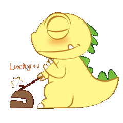
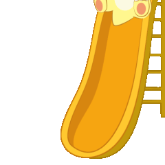
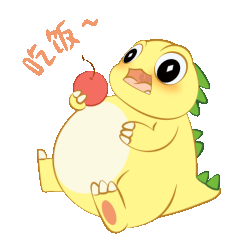
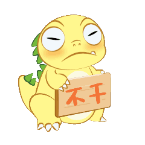
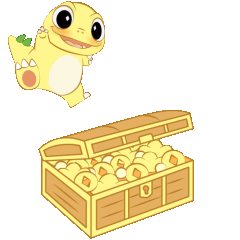
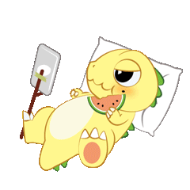
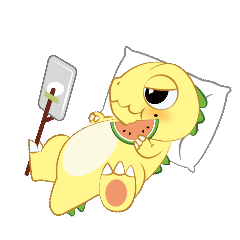

# LemonLoong Emoji

柠萌龙的表情包，柠萌龙的本体是一个柠檬，它是一只柠檬精。微信表情包搜索：柠萌龙。

The emoji pack of LemonLoong, whose essence is a lemon, is a lemon fairy. The author is XiaoFan.

|                        |                             | lucky+1 功德+1        |
| ------------------------------------------------------------ | ------------------------------------------------------------ | -------------------------- |
|                      |                      | coming  我来了        |
|                      |                      | time to eat  吃饭     |
|                            |                            | hey  在吗             |
|                            |                            | hum  哼               |
|                              |                              | no  不干了            |
|                    |                    | richhhhh  恭喜发财    |
|                |                | so sleepy  好困       |
|        |        | spill the tea  吃瓜   |
|                      |                      | thanks boss  谢谢老板 |
|  |  | 666 awful             |
|  |  | curious good night    |
|  |  | happy hi              |
|  |  | lie flat love         |
|  |  | so sad shocked        |
|  |  | thank you toilet      |
|  |  | working wow           |

